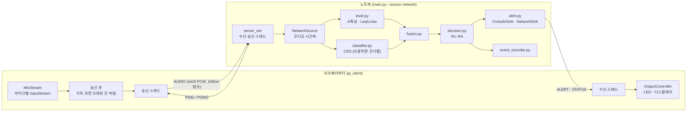

# noise_guard — 층간소음 경고 시스템

여러 개의 마이크로 집 안 소리를 실시간 수집하고, CED 오디오 분류 모델로 소리 종류를 판별해 한국 공동주택
층간소음 기준(2023 개정)을 넘는지 판단하고 경고하는 시스템입니다.

## 개요

- **Phase 1**: 노트북 한 대에서 수집, 레벨 계산, 분류, 판단, 알림까지 전체 파이프라인을 실행합니다.
  마이크 대신 wav 파일을 입력으로 쓸 수 있어, 장치 없이도 시나리오를 재현할 수 있습니다.
- **Phase 2(현재)**: 라즈베리파이는 마이크 수집과 LED·디스플레이 출력만 맡고, 노트북이 나머지
  (레벨 계산, CED 분류, 마이크 통합, 판단, 이벤트 녹음)를 모두 합니다. 둘은 유선 랜(TCP) 하나로 양방향 통신합니다.
- 라즈베리파이와 USB 마이크가 아직 없어서, 지금은 노트북 한 대에서 서버와 Pi 클라이언트를 함께 띄워
  `127.0.0.1`로 검증했습니다. Pi 클라이언트는 wav 파일을 마이크처럼 흘려보내는 모드(`FileStream`)로 테스트했습니다.
- dB 값은 **소음계 보정 전에는 임시 오프셋**을 적용한 추정치입니다. 보정하지 않은 방은 실행 중 계속
  "보정 안 됨"으로 표시됩니다.

## 구조



| 역할 | 라즈베리파이 | 노트북 |
|---|---|---|
| 수집 | 마이크별 `InputStream`을 계속 열어 두고 100ms 청크를 송신 큐에 넣음 | — |
| 계산·판단 | — | 레벨(dB), CED 분류, 대표 마이크 선택, R1~R4 판단 |
| 출력 | ALERT·STATUS를 받아 LED 점멸·디스플레이 표시 (지금은 콘솔로 흉내) | 콘솔 상태 줄·알림, CSV 로그 |
| 데이터 수집 | — | 알림 앞뒤 오디오를 `data/events/`에 저장 |
| 의존성 | `numpy`, `sounddevice` (torch·transformers·scipy 없음) | `requirements.txt` 전체 |

메시지 흐름은 다음과 같습니다.

1. Pi가 접속해 `HELLO`(마이크 목록, 샘플레이트, 청크 크기)를 보내고, 노트북이 검증해 `HELLO_ACK`로 답합니다.
1. Pi는 마이크마다 100ms 청크를 `AUDIO`로 계속 보냅니다. 조용한 구간도 보냅니다. R3/R4가 1분·5분 Leq라서
   연속 레벨이 필요하기 때문입니다.
1. 노트북은 모든 마이크에 1초 분량이 모이면 1 tick을 처리하고, 알림이 나면 `ALERT`, 마이크 상태가 바뀌면
   `STATUS`를 보냅니다.
1. 양쪽은 2초마다 `PING`을 보내고, 6초 동안 아무것도 받지 못하면 끊긴 것으로 봅니다. Pi는 지수 백오프로 다시
   연결하고, 노트북은 판단 상태를 유지한 채 다음 연결을 기다립니다.

## 팀 공통 dB 정의

모든 dB 값은 아래 한 가지 방법으로만 계산합니다(`level.py`).

```text
마이크 원래 샘플레이트(48kHz 등)의 PCM
  → A특성 필터 (IEC 61672 아날로그 전달함수를 bilinear 변환, 블록 사이 필터 상태 zi 유지)
  → 125ms 블록 RMS → dBFS(A)                       (소음계 Fast 시간가중의 근사)
  → 1초 Leq = 10·log10(mean(10^(블록/10))),  1초 Lmax = 블록 최댓값
  → + 마이크별 오프셋(calibration.json, 없으면 임시 +100 dB) = 추정 dB(A)
```

팀원별로 달랐던 아래 방식은 쓰지 않습니다.

- **peak 기반 dB:** 순간 최댓값은 소음계의 Leq·Lmax(Fast)와 정의가 달라 기준표와 비교할 수 없습니다.
- **2초 겹침 창 RMS:** 1초 hop마다 2초 창을 쓰면 같은 소리가 두 프레임에 겹쳐 들어가 Leq가 부풀려집니다.
  dB는 겹치지 않는 1초(125ms 블록 8개)로 계산하고, 2초 창은 CED 분류에만 씁니다.
- **16kHz에서 A특성 계산:** CED 입력용 16kHz로 내린 뒤 계산하면 8kHz 이상이 잘려 A특성 레벨이 달라집니다.
  레벨은 원래 샘플레이트에서 계산하고 16kHz 리샘플은 CED 입력에만 씁니다.

## 설치

### 노트북 (서버)

Windows 11, Python 3.11, CPU 추론 기준입니다. GPU(CUDA/MPS)가 있으면 자동으로 사용합니다.

```powershell
py -3.11 -m venv .venv
.\.venv\Scripts\python.exe -m pip install -r requirements.txt
```

- `requirements.txt`는 동작을 확인한 버전으로 고정되어 있습니다. torch와 torchaudio는 짝이 맞는 CPU 빌드
  (`2.11.0+cpu`), transformers는 `5.18.0`입니다.
- CED 모델은 첫 실행 때 Hugging Face에서 내려받습니다. `trust_remote_code` 모델이라 `config.CED_MODELS`에서
  커밋을 고정했습니다. 커스텀 feature extractor가 `torchaudio.transforms`를 쓰므로 torchaudio는 빠뜨리면 안 됩니다.

### 라즈베리파이 (클라이언트)

Raspberry Pi OS Bookworm(Python 3.11) 기준입니다. Pi에서는 저장소 전체를 받되, **`pi_client/requirements.txt`만
설치**합니다. `pi_client`는 루트의 `protocol.py`만 함께 씁니다.

```bash
sudo apt install libportaudio2 python3-venv
git clone https://github.com/wfycb/noise-guard.git ~/noise_guard
cd ~/noise_guard
python3 -m venv .venv
.venv/bin/pip install -r pi_client/requirements.txt
```

- `libportaudio2`는 `sounddevice`가 쓰는 시스템 라이브러리입니다.
- Pi 실기기에서의 설치는 아직 확인하지 못했습니다(남은 작업).

## 빠른 시작

### 파일 하나로 전체 파이프라인 (Phase 1 방식)

ESC-50 클립이 `data/esc50/`에 있어야 합니다([시나리오와 ESC-50 데이터](#시나리오와-esc-50-데이터) 참고).

```powershell
.\.venv\Scripts\python.exe -m tools.make_scenario
.\.venv\Scripts\python.exe main.py --source file `
    --files "거실=data/scenarios/S1_footsteps_x3_거실.wav" `
    --demo --fast --start-time "2026-10-02 14:00"
```

### 한 노트북에서 서버 + Pi 클라이언트 (localhost)

터미널 두 개를 엽니다. `127.0.0.1`로 bind하면 Windows 방화벽 팝업이 뜨지 않습니다.

```powershell
# 터미널 1: 서버
.\.venv\Scripts\python.exe main.py --source network --host 127.0.0.1 --demo --start-time "2026-10-02 14:00"
```

```powershell
# 터미널 2: Pi 클라이언트 (S1을 실시간 속도로 재생)
.\.venv\Scripts\python.exe -m pi_client.main --server 127.0.0.1 --source file `
    --files "거실=data/scenarios/S1_footsteps_x3_거실.wav"
```

약 30초 안에 서버 콘솔에는 합쳐진 경고(`[경고] R1+R2+R3`)가, 클라이언트 콘솔에는 디스플레이 박스와
`[LED] ● 점등`이 뜹니다.

```text
14:00:23 | 마이크 1/1 | 거실   | Leq  68.6 Lmax  75.9 dB(A) | impact   | Walk, footsteps
!!!!!!!!!!!!!!!!!!!!!!!!!!!!!!!!!!!!!!!!!!!!!!!!!!!!!!!!!!!!!!!!!!!!!!!!
!! [경고] R1+R2+R3
   - [주의] 거실에서 충격소음(Walk, footsteps) 감지 — 최대 75.9 dB(A), 최근 1분 3회
   - [경고] 거실 충격소음 반복 — 최근 1분 3회 기준 초과 (거실 3회 / 주간 기준 57 dB(A))
   - [경고] 거실 충격소음 지속 — 최근 20초 Leq 61.8 dB(A) (주간 기준 39 dB(A))
   (보정 안 됨: 거실 dB는 임시 오프셋 +100 기준)
!!!!!!!!!!!!!!!!!!!!!!!!!!!!!!!!!!!!!!!!!!!!!!!!!!!!!!!!!!!!!!!!!!!!!!!!
```

## 실행 방법

### 노트북: main.py

| 옵션 | 설명 |
|---|---|
| `--source mic\|file\|network` | 입력. 로컬 마이크, wav 파일, 또는 Pi 연결. 기본값 `mic` |
| `--host`, `--port` | network 모드 bind 주소와 포트. 기본값 `config.SERVER_BIND_HOST`(`0.0.0.0`), `5000` |
| `--mics 거실,안방` | mic 모드에서 `MIC_DEVICES` 중 일부만 사용 |
| `--files 거실=a.wav,안방=b.wav` | file 모드 입력. 파일 하나를 마이크 하나로 보고 원래 샘플레이트를 유지 |
| `--demo` | 시연용 짧은 시간창 사용 |
| `--fast` | file 모드에서 기다리지 않고 가상 시계로 처리 |
| `--start-time "YYYY-MM-DD HH:MM"` | file·network 모드 가상 시계 시작 시각(Asia/Seoul). 야간 기준 테스트용 |
| `--file-end stop\|pad`, `--duration 초` | 파일이 끝났을 때 동작, 처리 시간 제한 |
| `--log-file frames.csv` | 프레임별 결과 CSV. 원본 알림은 `frames_alerts.csv`에 함께 저장 |
| `--model base\|mini` | CED 모델 크기. 기본값 `base` |
| `--no-skip` | 조용할 때 분류 건너뛰기를 끔 |
| `--calibration-file` | 보정 파일. 기본값 `calibration.json` |
| `--record-events` / `--no-record-events`, `--event-dir` | 이벤트 녹음 켜기·끄기(기본 켬)와 저장 위치 |

Ctrl+C로 끝내면 요약(프레임 수, 규칙별 알림, overflow, 분류 건너뜀 비율, 추론·처리 지연, hop 초과 횟수,
마이크별 빠진 tick, network 모드의 수신 통계)을 출력합니다.

### 라즈베리파이: pi_client.main

| 옵션 | 설명 |
|---|---|
| `--server`, `--port` | 노트북 주소. 기본값은 `pi_client/client_config.py`의 `SERVER_HOST`(`192.168.10.1`), `5000` |
| `--source mic\|file` | 마이크 또는 테스트용 wav 재생 |
| `--files 거실=a.wav,…` | file 모드 입력 |
| `--fast` | file 모드에서 기다리지 않고 전송 |
| `--stall 안방=10:8` | file 모드에서 그 방만 10초 지점부터 8초 전송 중단(마이크 이상 표시 확인용) |
| `--no-reconnect` | 끊기면 다시 연결하지 않고 종료 |
| `--client-id`, `--log-file` | 클라이언트 이름, 로그 파일 |

마이크 장치는 `client_config.MIC_DEVICES`에 `방 이름 → 장치`로 넣습니다([장치 매핑](#장치-매핑) 참고).

### 보조 도구

| 도구 | 용도 |
|---|---|
| `tools/list_devices.py` | 오디오 입력 장치 목록 (sounddevice만 써서 Pi에서도 실행 가능) |
| `tools/classify_live.py` | 단일 마이크 실시간 분류, top-5 라벨, 추론 지연 |
| `tools/classify_file.py` | wav 파일·폴더 분류, ESC-50 클래스별 판정 분포 (`--model`로 base/mini 비교) |
| `tools/dump_labels.py` | CED `id2label` 전체를 `labels_dump.txt`로 저장 |
| `tools/make_scenario.py` | ESC-50 클립을 이어 붙여 시나리오 wav 생성 |
| `tools/calibrate.py` | 소음계 보정 ([소음계 보정](#소음계-보정) 참고) |
| `tools/check.ps1` | 커밋 전 검사 (black, ruff, pytest, pytest -m slow) |

### 테스트

```powershell
powershell -NoProfile -ExecutionPolicy Bypass -File tools\check.ps1
```

- black --check → ruff → pytest(기본) → pytest -m slow를 순서대로 실행하고, 하나라도 실패하면 그 단계의 종료
  코드로 멈춥니다. 커밋 전에는 항상 이 스크립트를 돌립니다.
- 기본 테스트는 장치·모델 없이 돌아갑니다(가짜 분류기, `127.0.0.1` loopback, 합성 신호).
- `slow`는 CED와 ESC-50이 필요한 시나리오 회귀(S1~S6)와 네트워크 동등성(S1, S5) 테스트입니다.

### 시나리오와 ESC-50 데이터

시나리오는 [ESC-50][esc50]의 9개 클래스 클립 360개를 씁니다(약 150MB).

> **`data/` 폴더는 저장소에 포함되지 않습니다.** ESC-50 클립, 시나리오 wav, 실행 로그, 이벤트 녹음이 모두
> `data/` 아래에 있으며, 아래 명령으로 다시 만들 수 있습니다.

ESC-50 저장소 전체(약 600MB) 대신 메타데이터와 대상 9개 클래스의 wav만 받습니다. 프로젝트 루트의 Git Bash에서 실행합니다.

```bash
mkdir -p data/esc50/meta data/esc50/audio
base=https://raw.githubusercontent.com/karolpiczak/ESC-50/master
curl -sSfL -o data/esc50/meta/esc50.csv "$base/meta/esc50.csv"
classes='footsteps|door_wood_knock|door_wood_creaks|toilet_flush|pouring_water|water_drops|clapping|dog|crying_baby'
awk -F, -v pattern="^($classes)$" 'NR > 1 && $4 ~ pattern {print $1}' data/esc50/meta/esc50.csv \
    | xargs -P 8 -I{} curl -sSfL -o data/esc50/audio/{} "$base/audio/{}"
ls data/esc50/audio | wc -l   # 360이면 성공
```

받은 뒤 `.\.venv\Scripts\python.exe -m tools.make_scenario`로 `data/scenarios/`에 시나리오 wav를 만듭니다.

| 시나리오 | 내용 | 기대 알림 (데모, 주간) |
|---|---|---|
| S1 | 발소리 클립 3개, 5초 간격 | R1 ×3, R2 ×1, R3 ×3 |
| S2 | 물소리만 | 없음 |
| S3 | 물소리 + 발소리 (원래 진폭) | 없음 (알려진 한계: 마스킹) |
| S3b | 물소리 −20 dB + 발소리 | R1 ×1, R3 ×1 |
| S4 | 개 + 아기 울음 75초 | R4 ×7 |
| S5 | 거실 → 안방 발소리 (두 파일) | R1 ×2, R3 ×2, 위치 전환 |
| S6 | 방 5개 동시 (부하 확인용) | 회귀 대상 아님 |

## 통신 규격

자세한 내용은 [protocol.py](protocol.py)에 있습니다. 서버와 Pi가 같은 파일을 씁니다.

**프레이밍:** `[본문 길이 uint32 big-endian (타입 1바이트 포함)][타입 uint8][본문]`

- 길이 접두는 big-endian(네트워크 바이트 순서)이고, AUDIO 헤더와 PCM은 little-endian입니다. 섞여 있는 것은
  의도입니다. x86과 ARM(Pi) 모두 little-endian이라 PCM을 변환 없이 쓸 수 있습니다.
- 길이가 0이거나 1 MiB를 넘으면 본문을 읽지 않고 연결을 끊습니다.

| 타입 | 값 | 방향 | 본문 |
|---|---|---|---|
| `HELLO` | 1 | Pi → 노트북 | JSON `{protocol_version, client_id, mics: [{index, room, sample_rate}], chunk_samples}` |
| `HELLO_ACK` | 2 | 노트북 → Pi | JSON `{accepted, reasons, server_time}` |
| `AUDIO` | 3 | Pi → 노트북 | `<BIIH` 헤더 11바이트(mic_index u8, seq u32, flags u32, sample_count u16) + int16 LE PCM |
| `ALERT` | 4 | 노트북 → Pi | JSON: level, rules, room, category, label, label_ko, peak_db, count, room_counts, message, timestamp, source_mic_index, source_seq (+ 선택 calibrated) |
| `PING` / `PONG` | 5 / 6 | 양방향 | 없음 |
| `STATUS` | 7 | 노트북 → Pi | JSON `{missing_mics, active_mics, total_mics, timestamp}`. 세션 첫 프레임과 상태가 바뀔 때만 |

- **AUDIO flags:** bit0 = 그 청크 구간에서 Pi 오디오 콜백 overflow. 나머지 비트는 예약(0)이고, 켜져 있으면 규격 위반입니다.
- **HELLO 검증(거부 사유):** 프로토콜 버전 불일치, 마이크 0개 또는 8개 초과, 샘플레이트가 16000·44100·48000이 아님,
  `chunk_samples`가 160~65535 밖, 방 이름이 비었거나 중복, mic index 중복. 동시 연결은 하나만 받습니다.
- **시간 기준:** Pi 시계를 믿지 않습니다. 노트북이 HELLO를 받은 시각을 시작으로, `seq × chunk_samples`(오디오 샘플 수)로
  시각을 셉니다. 빠진 seq는 무음으로 채워 시간축이 밀리지 않게 합니다.
- **오류 정책:** 메시지 경계가 깨지면(`FramingError`: 길이, 타입, AUDIO 헤더, 예약 flags) 연결을 끊습니다.
  경계는 정상인데 내용이 틀리면(`PayloadError`: ALERT·STATUS JSON) 경고 로그만 남기고 그 메시지를 무시합니다.
- **종단 지연 측정:** ALERT의 `source_mic_index`·`source_seq`로 Pi가 그 청크의 캡처 시각을 찾아 "수신 시각 − 캡처
  시각"을 자기 시계로 계산합니다. 시계 동기화가 필요 없습니다.

## 실제 배포: 노트북 + Pi 직결

노트북에 USB-RJ45 젠더를 꽂고 cat6 케이블로 Pi와 직접 연결합니다.

### 직결 랜 설정

| 장치 | 고정 IP |
|---|---|
| 노트북 (USB 랜) | `192.168.10.1/24` |
| 라즈베리파이 | `192.168.10.2/24` |

**노트북(Windows):** 설정 → 네트워크 → 해당 이더넷 → IP 할당 → 수동에서 위 주소를 넣거나, 관리자 PowerShell에서
아래처럼 설정합니다. 인터페이스 이름은 `Get-NetAdapter`로 확인하세요(확인 필요).

```powershell
New-NetIPAddress -InterfaceAlias "이더넷 2" -IPAddress 192.168.10.1 -PrefixLength 24
# 서버 포트 인바운드 허용 (Pi 주소에서만)
New-NetFirewallRule -DisplayName "noise_guard 5000" -Direction Inbound -Protocol TCP `
    -LocalPort 5000 -RemoteAddress 192.168.10.2 -Action Allow
```

- 서버 bind 주소는 기본값 `0.0.0.0`(모든 인터페이스)입니다. **직결 랜 인터페이스 IP로 바꾸는 것을 권장합니다**
  (`--host 192.168.10.1` 또는 `config.SERVER_BIND_HOST`). 다른 네트워크에서 접속을 받지 않게 하기 위해서입니다.

**라즈베리파이(Bookworm):** Bookworm은 NetworkManager를 씁니다. 연결 이름은 `nmcli con show`로 확인하세요
(아래 `"Wired connection 1"`은 확인 필요).

```bash
sudo nmcli con mod "Wired connection 1" ipv4.addresses 192.168.10.2/24 ipv4.method manual
sudo nmcli con up "Wired connection 1"
ping -c 3 192.168.10.1
```

### 장치 매핑

- **Pi 마이크:** `client_config.MIC_DEVICES`에 `방 이름 → 장치 인덱스(또는 이름)`를 넣습니다.
- **노트북 마이크(mic 모드):** `config.MIC_DEVICES`에 같은 형식으로 넣습니다.

1. 입력 장치 목록을 확인합니다. Pi에서는 `.venv/bin/python -m tools.list_devices`입니다.

    ```powershell
    .\.venv\Scripts\python.exe -m tools.list_devices
    ```

1. Windows에서는 같은 장치가 호스트 API(MME, DirectSound, WASAPI, WDM-KS)마다 따로 나옵니다. 48kHz를 기본으로
   쓰는 **WASAPI** 항목을 고릅니다.
1. 같은 모델의 USB 마이크 여러 개는 이름이 같아 구분할 수 없습니다. 하나씩 꽂으면서 목록을 다시 보고, 새로 생긴
   인덱스를 방에 대응시킵니다. 꽂고 빼면 인덱스가 바뀔 수 있으니 구성을 바꿀 때마다 다시 확인합니다.

### Pi 백그라운드 실행

SSH를 끊어도 계속 돌도록 `nohup`으로 띄웁니다. 로그는 `~/noise_guard/logs/pi_client.log`에 남습니다.

```bash
mkdir -p ~/noise_guard/logs
cd ~/noise_guard
nohup .venv/bin/python -m pi_client.main --server 192.168.10.1 --port 5000 --source mic \
    > ~/noise_guard/logs/pi_client.log 2>&1 &
tail -f ~/noise_guard/logs/pi_client.log
```

부팅 시 자동 실행용 systemd 서비스 예시입니다. **설치와 확인은 남은 작업**이며, 사용자 이름(`pi`)과 경로는
실제 환경에 맞게 바꿔야 합니다.

```ini
# /etc/systemd/system/noise-guard-pi.service (예시, 미설치)
[Unit]
Description=noise_guard Pi client
After=network-online.target sound.target
Wants=network-online.target

[Service]
User=pi
WorkingDirectory=/home/pi/noise_guard
ExecStart=/home/pi/noise_guard/.venv/bin/python -m pi_client.main --server 192.168.10.1 --port 5000 --source mic --log-file /home/pi/noise_guard/logs/pi_client.log
Restart=on-failure
RestartSec=5

[Install]
WantedBy=multi-user.target
```

### 연결이 끊겼을 때

- Pi는 1초부터 두 배씩(최대 30초) 다시 연결합니다. 다시 연결되면 seq를 0부터 세고, 끊긴 동안 쌓인 오디오는 버리고
  그 양을 로그로 남깁니다.
- Pi 화면에는 `[서버 연결 끊김] 12초째 — 소음 감지 중단`과 `[마이크 상태] 확인 불가`가 표시됩니다. 마지막으로 받은
  마이크 정보를 정상처럼 보이지 않게 하기 위해서입니다.
- 노트북 서버는 판단 상태(R1 카운트, Leq 창)를 유지한 채 다음 연결을 기다립니다. 단, 서버 프로세스를 재시작하면
  상태가 초기화됩니다.

### 마이크 이상 표시 확인 방법

`pi_client`의 file 모드에 `--stall 방=시작초:길이초`를 주면, 그 구간 동안 해당 마이크만 전송을 멈춥니다.
청크는 버리고 seq는 계속 늘어나므로 실제 마이크가 멈춘 상황과 같습니다.

```powershell
# 터미널 1
.\.venv\Scripts\python.exe main.py --source network --host 127.0.0.1 --demo
# 터미널 2: 안방 마이크만 10초 지점부터 8초 동안 멈춤
.\.venv\Scripts\python.exe -m pi_client.main --server 127.0.0.1 --source file `
    --files "거실=data/scenarios/S5_two_rooms_거실.wav,안방=data/scenarios/S5_two_rooms_안방.wav" `
    --stall 안방=10:8
```

- 서버 콘솔: `## [마이크 이상] 안방: 3초째 데이터 없음`, 상태 줄 `마이크 1/2`, 이어서 `## [마이크 복구]`
- Pi 콘솔: `[마이크 이상] 안방 (활성 1/2)`, 이어서 `[마이크 정상] 2/2`
- 멈춤은 5초 이상 주어야 합니다([알려진 한계](#--stall로-멈춘-시간과-빠짐-집계의-차이) 참고).

## 소음계 보정

`tools/calibrate.py`로 마이크별 오프셋(dBFS(A) → dB(A))을 잽니다. 레벨 계산은 서버와 같은 `LevelMeter`를 씁니다.

1. 방을 조용하게 두고 배경 소음을 `CALIBRATION_MEASURE_SEC`(10초) 동안 잽니다.
1. 스피커로 핑크노이즈를 일정하게 재생합니다.
1. 소음계를 마이크 바로 옆에 두고 **A특성, Leq 모드**로 맞춥니다. Leq 모드가 없으면 Fast로 여러 번 읽어 평균합니다.
1. 프로그램이 10초 동안 Leq를 재는 동안 소음계도 같은 시간 동안 잽니다.
1. 소음계 값을 입력하면 `offset = 소음계 Leq − 프로그램 Leq`를 계산합니다.
1. `--levels 3`이면 볼륨을 바꿔 4~5를 세 번 하고, 오프셋 차이가 `CALIBRATION_MAX_SPREAD_DB`(2 dB)를 넘으면
   경고합니다. 마이크 AGC(자동 이득)가 켜져 있으면 이 차이가 커집니다.
1. 단계마다 핑크노이즈 Leq가 배경 Leq보다 `CALIBRATION_MIN_SNR_DB`(10 dB) 이상 크지 않으면
   "보정 신호가 배경 소음에 비해 작음, 볼륨을 올리세요"라고 경고하고 그 단계를 다시 잴지 묻습니다.

```powershell
# 노트북에 꽂은 마이크
.\.venv\Scripts\python.exe -m tools.calibrate --mic 거실 --source mic --device 18 --levels 3
# Pi 마이크: 이 도구가 서버가 되고, Pi에서는 평소처럼 pi_client를 실행한다
.\.venv\Scripts\python.exe -m tools.calibrate --mic 거실 --source network --port 5000 --levels 3
```

결과는 `calibration.json`에 방 이름별로 저장됩니다(`offset_db`, `meter_leq`, `program_leq`, `levels`,
`background_leq_db`, `sample_rate`, `device`, `measured_at`). 다른 방의 결과는 그대로 둡니다.
형식은 [calibration.example.json](calibration.example.json)에 있습니다(숫자는 모두 예시값).

- **보정값은 마이크 장비와 설치 위치마다 다른 값이라 git에 넣지 않습니다**(`.gitignore`에 등록).
  팀원과 공유하려면 `calibration.json` 파일을 직접 전달하세요. 마이크나 위치를 바꾸면 다시 잽니다.
- 테스트와 예시 생성은 프로젝트 루트에 `calibration.json`을 만들지 않습니다. 테스트가 루트에 만들면 실패하도록
  `tests/conftest.py`가 검사합니다.
- 서버는 시작할 때 `calibration.json`(또는 `--calibration-file`)이 있으면 방별 오프셋을 씁니다. 파일에 없는 방은
  임시 오프셋 +100 dB를 쓰고, **시작 로그와 그 방의 모든 알림에 "보정 안 됨"을 표시**합니다(콘솔, Pi 디스플레이).
- 파일이 깨져 있으면 몇 번째 줄이 틀렸는지 알려주고 시작하지 않습니다.

보정이 끝나면 배경 소음(보정 후 dB(A))으로 두 가지를 점검해 경고합니다. **게이트 값은 자동으로 바꾸지 않고
권장값만 출력**합니다.

- 배경 Leq ≥ `SKIP_CLASSIFY_BELOW_DB`: 게이트가 배경 소음보다 낮아 건너뛰기가 일어나지 않습니다.
- 배경 Leq ≥ 최저 판단 기준(야간 34) − 5: 배경 소음이 기준에 가까워 오탐 위험이 있습니다.
- 권장 게이트 = min(배경 Leq + 3 dB, 최저 기준 − 마진 10 dB).

## 이벤트 녹음

알림(caution 또는 warning)이 나면 **모든 마이크**의 원래 샘플레이트 오디오를 알림 시각 기준 앞 2초 + 뒤 3초
저장합니다. 미니어처 실측 데이터를 모아 임계값과 오프셋을 다시 조정하기 위한 것이고, 판단에는 쓰지 않습니다.

> **개인정보 안내**
>
> - 경고가 날 때 **모든 방의 소리가 그대로 저장됩니다. 대화 소리도 포함됩니다.**
> - `data/`는 git에서 제외되지만, **녹음 파일을 공유하거나 외부(클라우드, 메신저, 공개 저장소)에 올리지 마세요.**
> - 녹음이 필요 없으면 `--no-record-events`로 끕니다.
> - 다 쓴 녹음은 `data/events` 폴더째 지우면 됩니다.

- 저장 위치: `data/events/YYYYMMDD_HHMMSS_<규칙>/` (예: `20261002_140023_R1+R2+R3`). 같은 이름이 이미 있으면
  덮어쓰지 않고 `_2`, `_3`을 붙입니다.
- 파일: 방별 `<방>.wav`(int16)와 `meta.json`(합친 알림, 대표 마이크, 프레임별 마이크 Leq·Lmax·카테고리 확률·
  top 라벨, 그때의 보정 오프셋, 모델 이름, 임계값, 게이트).
- 녹음 중 새 알림이 오면 끝 시각만 늦추고, 전체 길이는 `EVENT_MAX_SEC`(30초)를 넘지 않습니다.
- 마이크가 빠진 tick은 무음으로 채워 마이크 사이의 시간을 맞춥니다. 시작 직후라 앞 2초가 모자라면 무음으로 채우고
  `meta.json`의 `pre_padded_sec`에 적습니다.
- 수집은 멈추지 않습니다. 파일 쓰기는 별도 저장 스레드가 합니다.
- 전체 용량이 `EVENT_MAX_TOTAL_MB`(500MB)를 넘으면 가장 오래된 이벤트부터 지우고 로그로 남깁니다.

## 시연 전 체크리스트

1. **다른 프로그램을 종료합니다.** 브라우저, 메신저(Discord 등)가 CPU를 쓰면 추론이 순간적으로 느려져
   처리 지연이 1초를 넘을 수 있습니다(측정 중 실제로 1,463 ms까지 튄 적이 있음). 서버 로그에
   `[처리 지연] … ms > 1000 ms`가 보이면 이 상태입니다.
1. **노트북 전원을 연결하고 Windows 전원 모드를 "최고 성능"으로 둡니다.** 배터리 절약 모드에서는 CPU가 느려집니다.
1. **시연 중에는 서버를 재시작하지 않습니다.** 재시작하면 R1 카운트와 Leq 창이 초기화됩니다(Pi 재접속은 괜찮음).
1. **`calibration.json`이 있는지 확인합니다.** 서버 시작 로그에 `보정 적용: …`이 나와야 하고, `보정 안 됨`
   경고가 없어야 합니다.
1. **서버 상태 줄의 마이크 수가 모두 활성인지 확인합니다**(예: `마이크 5/5`, `4/5`가 아님).
   Pi 화면에 `[마이크 이상]`이나 `[서버 연결 끊김]`이 없어야 합니다.

## 설정값

서버 상수는 `config.py`, Pi 상수는 `pi_client/client_config.py`, 통신 규격 상수는 `protocol.py`에 있습니다.

| 상수 | 값 | 설명 |
|---|---|---|
| `CAPTURE_SAMPLE_RATE` | 48000 | 마이크 수집 샘플레이트. dB 계산은 이 샘플레이트에서 함 |
| `CLASSIFY_WINDOW_SEC` / `CLASSIFY_HOP_SEC` | 2.0 / 1.0 | CED 분류 창과 간격. 16kHz로 리샘플해 입력 |
| `CED_MODELS` / `CED_MODEL_SIZE` | base, mini / `base` | 모델 이름과 고정 커밋 |
| `AIRBORNE_SCOPE` | `"extended"` | 공기전달소음 라벨 범위(`legal` / `extended`) |
| `CLASS_PROB_THRESHOLD` | IMPACT 0.2, AIRBORNE 0.3 | 카테고리 판정 임계값. **임시값** |
| `IMPACT_LMAX_LIMIT_*_DB` | 주 57 / 야 52 | 직접충격 Lmax 기준 |
| `IMPACT_LEQ_LIMIT_*_DB` | 주 39 / 야 34 | 직접충격 1분 Leq 기준 |
| `AIRBORNE_LEQ_LIMIT_*_DB` | 주 45 / 야 40 | 공기전달 5분 Leq 기준 |
| `LMAX_COUNT_TO_WARN` / `LMAX_WINDOW_SEC` | 3 / 3600 | R2: 1시간에 3회 |
| `IMPACT_LEQ_WINDOW_SEC` / `AIRBORNE_LEQ_WINDOW_SEC` | 60 / 300 | R3, R4 시간창 |
| `MERGE_GAP_SEC` / `EFFECTIVE_MERGE_GAP_SEC` | 2.0 / 3.0 | 이벤트 병합 간격 / 실제 무음 기준(계산값) |
| `COOLDOWN_SEC` | 30 | 같은 규칙 warning 재발령 금지 시간 |
| `DEMO_*` | Lmax 창 60, R3 창 20, R4 창 60, 쿨다운 10 | `--demo`에서 쓰는 시간창 |
| `LEQ_FLOOR_DB` | 0.0 | Leq 창에서 해당 카테고리가 아닌 구간을 채우는 바닥 레벨 |
| `SKIP_CLASSIFY_BELOW_DB` / `SKIP_MARGIN_DB` | 24 / 10 | 조용할 때 분류 건너뛰기 게이트. **보정 전 임시** |
| `DEFAULT_CALIBRATION_OFFSET_DB` | 100.0 | 보정 안 된 방의 오프셋. **임시값** |
| `SERVER_BIND_HOST` / `SERVER_PORT` | `0.0.0.0` / 5000 | 서버 bind. 직결 랜 IP로 바꾸는 것을 권장 |
| `PEER_TIMEOUT_SEC` / `PING_INTERVAL_SEC` | 6 / 2 | 수신 타임아웃과 PING 간격(타임아웃의 1/3 이하) |
| `MIC_STALL_TIMEOUT_SEC` | 2.0 | 한 마이크만 늦을 때 그 tick에서 빼기까지 기다리는 시간 |
| `MIC_MISSING_WARN_TICKS` | 3 | 연속으로 빠지면 "마이크 이상" |
| `EVENT_PRE_SEC` / `EVENT_POST_SEC` / `EVENT_MAX_SEC` | 2 / 3 / 30 | 이벤트 녹음 구간 |
| `EVENT_MAX_TOTAL_MB` | 500 | 이벤트 전체 용량 상한 |
| `MIC_DEVICES` | `{"거실": 18}` | 노트북 mic 모드 방 이름 → 장치 |

## 판단 규칙

주간(06–22시)과 야간(22–06시)은 프레임 시각의 로컬 시간(Asia/Seoul, 고정 UTC+9)으로 정합니다. 판단 로직은
`frame.timestamp`만 시간으로 쓰고 내부에서 시계를 읽지 않습니다.

| 규칙 | 조건 | 결과 | 평가 시점 |
|---|---|---|---|
| R0 | 프레임 판정: IMPACT·AIRBORNE 중 임계값을 넘은 쪽 중 확률이 높은 쪽. 둘 다 미만이면 스킵 | 카테고리 | 매 프레임 |
| R1 | IMPACT 이벤트의 Lmax ≥ Lmax 기준 | caution, 카운트 +1 | 이벤트에서 처음 넘는 프레임에서 1회 |
| R2 | 시간창 안 R1 카운트 ≥ 3 | warning | R1 카운트가 늘 때 |
| R3 | IMPACT 프레임의 1분 Leq ≥ 기준 | warning | IMPACT 프레임이 들어올 때 |
| R4 | AIRBORNE 프레임의 5분 Leq ≥ 기준 | warning | AIRBORNE 프레임이 들어올 때 |

- R0은 사양 9.2의 프레임 판정을 이 문서에서 부르는 이름입니다. EXCLUDED(급배수)는 판정에 쓰지 않습니다. 그래서
  물소리 단독은 스킵되고, 물소리와 발소리가 겹쳐도 IMPACT가 임계값을 넘으면 IMPACT로 처리합니다.
- warning은 같은 규칙에 대해 쿨다운 동안 다시 내지 않습니다.
- R2는 카운트가 늘 때만, R3/R4는 해당 카테고리 프레임이 들어올 때만 평가합니다. 소음이 멈춘 뒤 같은 경고가
  반복되지 않게 하기 위해서입니다.
- R1/R2 카운트는 **집 전체 기준**입니다. 대신 R2 메시지와 `Alert.room_counts`에 방별 내역을 붙입니다.

### 알림 합치기

`decision.py`는 규칙별로 Alert를 따로 반환합니다. 출력(`alert.py`)은 같은 프레임의 알림을 **1건으로 합쳐**
표시하고 Pi에도 ALERT 하나로 보냅니다. 등급은 가장 높은 것(warning > caution)을, 규칙은 발령 순서대로
`R1+R2+R3`처럼 씁니다. CSV(`*_alerts.csv`)와 이벤트 `meta.json`에는 원본 메시지를 모두 남깁니다.

## 설계 선택

### 카테고리별 Leq

R3/R4의 Leq는 **해당 카테고리로 판정된 프레임만** 에너지에 넣고, **창 전체 길이로 나눕니다**(사양 9.5의 (a)).
창 안에서 그 카테고리가 아닌 구간은 `LEQ_FLOOR_DB`(0 dB(A))로 채웁니다.

- 법정 측정은 카테고리를 구분하지 않고 잽니다. 이 시스템은 **분류된 소음의 기여분만 본다**는 설계를 택했습니다.
- 시작 직후처럼 창이 다 차지 않았을 때도 창 전체 길이로 나눕니다. 시작 직후의 과대 경고를 막기 위해서입니다.
- 1초 프레임 하나만으로 기준을 넘는 레벨은 `기준 + 10·log10(창 길이 / 1초)`입니다.

| 규칙 | 창 | 주간 기준 | 1초 프레임 하나로 넘는 레벨 |
|---|---|---|---|
| R3 | 60초 | 39 | 56.8 dB(A) |
| R4 | 300초 | 45 | 69.8 dB(A) |
| R3 데모 | 20초 | 39 | 52.0 dB(A) |
| R4 데모 | 60초 | 45 | 62.8 dB(A) |

### 이벤트 병합과 R2/R3 역할 분담

같은 카테고리 프레임이 `MERGE_GAP_SEC`(2초) 이내로 이어지면 이벤트 하나로 봅니다. R1 카운트는 이벤트 단위입니다.

- 분류 창(2초)이 hop(1초)보다 길어서 소리가 끝난 뒤에도 약 1초 동안 IMPACT 판정이 이어집니다. 그래서 **실제 무음
  기준 병합 간격은 약 3초**(`EFFECTIVE_MERGE_GAP_SEC`)입니다.
- **R2는 띄엄띄엄 반복되는 충격**을, **R3는 계속 이어지는 충격**을 잡습니다. 2초 간격으로 9번 걸은 발소리(S6 거실)는
  이벤트 1개(R1 1회)로 합쳐지지만, 걷는 동안 R3가 쿨다운마다 발령됐습니다(데모 모드에서 6회).

### 단발 충격에서 R1과 R3 동시 발령

R1은 `lmax_db`(125ms 블록 최댓값)를, R3는 `leq_db`(1초 에너지 평균)를 1분 창 전체로 나눠 씁니다. 1초 내내 57 dB(A)라면
1분 Leq는 `57 − 10·log10(60) ≈ 39.2 dB(A)`로 두 기준을 동시에 넘지만, 실제 충격음은 1초 안에서 금방 줄어
프레임 Leq가 Lmax보다 낮습니다(ESC-50 측정, 오프셋과 무관한 상대값).

| 소리 | Lmax − Leq | Lmax 57일 때 1분 Leq | R3 동시 발령 시작 Lmax |
|---|---|---|---|
| 단발 노크 5개 | 2.7~6.5 dB (중앙값 3.9) | 32.8~36.5 dB(A) | 59.5~63.2 dB(A) |
| 다발 노크 35개 | 중앙값 5.5 dB | — | 중앙값 60.4 dB(A) |
| 발소리 3개 (5초) | 7.5~7.8 dB | 32.7~38.3 dB(A) | 57.7~63.3 dB(A) |

Lmax가 기준에 딱 걸치는 단발 충격은 R1만 발령되고, 기준보다 약 3~6 dB 큰 충격부터는 단발이어도 R3가 함께
발령될 수 있습니다. 데모 모드는 R3 창이 20초라 대부분 함께 발령됩니다.

### 대표 마이크 선택

같은 시점에 여러 마이크가 같은 소리를 잡으므로, 1초 Leq가 가장 큰 마이크를 대표로 삼습니다.
위치, 레벨, 카테고리 확률 모두 그 마이크 값을 씁니다(`fusion.py`).

### AIRBORNE 범위: legal과 extended

카테고리 `AIRBORNE`은 하나이고, `AIRBORNE_SCOPE`에 따라 매핑되는 AudioSet 라벨 집합만 바뀝니다.

- **`legal`**: Television, Radio, AudioSet Music 하위 전체. 법적 공기전달소음은 **텔레비전·음향기기 등의 사용으로
  발생하는 소음**이 대상이므로 이 범위가 법 기준에 해당합니다.
- **`extended`(기본값)**: legal에 말소리·목소리, 군중, 휘파람, 개·고양이, 청소기, 블렌더를 더한 **배려 확장 모드**입니다.
  이 모드의 경고는 법적 기준 초과를 뜻하지 않습니다.
- 박수(`Clapping`, `Applause`)는 두 범위 모두에서 OTHER입니다.

### 조용할 때 분류 건너뛰기 (게이트)

마이크의 **분류 창(2초) Leq**가 `SKIP_CLASSIFY_BELOW_DB`(24 dB(A), 보정 전 임시)보다 낮으면 그 마이크는 CED에
넣지 않고 확률 0, 라벨 `(skipped: quiet)`으로 채웁니다. 모든 마이크가 조용하면 CED를 호출하지 않습니다.

- **1초가 아니라 2초 분류 창으로 판정하는 이유(분류 창과 판정 구간 일치):** CED는 2초 창을 보고 분류합니다.
  큰 소리가 막 끝난 프레임은 1초 Leq로는 조용하지만 창 안에는 그 소리가 있어서 CED가 IMPACT로 볼 수 있습니다.
  1초 기준으로 건너뛰면 이벤트 병합이 달라져 알림이 `--no-skip`과 달라졌습니다(마이크 1개 S6에서 R1 1회 추가).
  판정 구간을 분류 창과 맞추면 알림이 같아집니다(시나리오 S1~S6, base·mini 모두 일치).
- 게이트는 `최저 판단 기준(34) − SKIP_MARGIN_DB(10)` 이하여야 하며 시작할 때 검사합니다. 기준 근처 소리를
  건너뛰면 R3/R4 Leq가 과소평가되기 때문입니다.
- "크면 분류 없이 통과"는 넣지 않았습니다. 물소리를 거르지 못하기 때문입니다.

### 카테고리별 판정 임계값과 모델

`CLASS_PROB_THRESHOLD = {IMPACT: 0.2, AIRBORNE: 0.3}`이며, ESC-50 근거리 녹음과 base 모델로 정한 임시값입니다.

- **AIRBORNE 0.3:** 디지털 무음과 조용한 방에서도 CED가 `Music`을 0.11~0.13으로 냅니다.
- **IMPACT 0.2:** 무음 바닥값이 0.002 수준이고, 0.3보다 발소리 검출률이 높습니다(클립 82% vs 72%).
- **기본 모델은 base**입니다. mini는 약 2배 빠르지만 문 삐걱 → AIRBORNE 오분류가 늘었습니다(45% → 62%).
  더 느린 노트북에서는 `--model mini`를 고를 수 있지만, 임계값을 다시 조정해야 합니다.

## 성능

측정 환경은 Intel i7-1360P, CPU 추론입니다.

**Phase 2 네트워크(실시간 전송, S6 30초 구간):** 처리 지연은 tick 데이터가 모두 도착한 뒤 프레임이 나오기까지입니다.

| 모델 | 게이트 | 마이크 1 평균/최대 | 마이크 3 평균/최대 | 마이크 5 평균/p95/최대 |
|---|---|---|---|---|
| base | 끔 | 128 / 162 ms | 292 / 359 ms | 445 / 527 / 580 ms |
| base (기본) | 켬 | 106 / 144 ms | 219 / 310 ms | 331 / 421 / 442 ms |
| mini | 끔 | 52 / 66 ms | 108 / 224 ms | 180 / 246 / 260 ms |
| mini | 켬 | 44 / 59 ms | 100 / 220 ms | 144 / 211 / 238 ms |

- 종단 지연(프레임 마지막 청크 캡처 → Pi가 ALERT 수신, base): 마이크 1개 평균 104 ms, 5개 평균 478 ms.
  소리가 난 순간부터는 여기에 최대 1초(hop)가 더해집니다.
- 지연은 누적되지 않았습니다. 모든 마이크가 3초 멈췄다가 몰려와도 약 5프레임 안에 따라잡았습니다.
- 다른 프로그램의 부하로 한 번 1,463 ms까지 튄 적이 있습니다([시연 전 체크리스트](#시연-전-체크리스트) 참고).

## 알려진 한계

### 마스킹

물소리가 발소리보다 훨씬 크면 CED가 발소리를 듣지 못해 IMPACT 확률 자체가 임계값에 못 미칩니다. S3(RMS 차이
약 21 dB)는 IMPACT 최대 0.05로 기대 결과를 "알림 0"으로 둡니다. 물소리를 20 dB 낮춘 S3b에서는 두 쌍 중 한 쌍만
잡혔습니다.

### 음조 있는 소리의 음악 오분류

| 소리 | 오분류 | 비율 (base) | 원인 라벨 |
|---|---|---|---|
| 문 삐걱 | AIRBORNE | 45% | `Music`, `Theremin`, `Synthesizer` |
| 물방울 | AIRBORNE | 18% | `Wood block` |

원인 라벨이 법적 공기전달소음 집합에 속해 범위를 바꿔도 피할 수 없습니다. R4가 5분 Leq이고 창 전체 길이로
나누므로 몇 초짜리 오분류는 경고까지 가기 어렵지만, **1초 프레임 하나가 69.8 dB(A)(데모 62.8) 이상이면
그것만으로 R4 기준을 넘습니다.**

### 노트북 내장 마이크 DSP

인텔 SST 마이크 배열은 드라이버 DSP가 말소리가 아닌 소리(박수, 두드림)를 거의 지우고, 조용하면 신호를 디지털
무음 근처까지 내립니다. 그래서 내장 마이크로는 말소리만 실시간 검증했고, 충격음과 물소리는 ESC-50 파일로
검증했습니다.

### ESC-50 근거리 녹음 기준 임계값

임계값, 무음 바닥값, 오분류율은 모두 근거리에서 녹음한 ESC-50 클립으로 정했습니다. 바닥과 벽을 통과한 소리는
고역이 깎이므로 확률이 더 낮게 나올 수 있습니다.

### 서버 재시작 시 판단 상태 초기화

판단 상태(R1 카운트, R3/R4의 Leq 창, 쿨다운)는 노트북 서버 프로세스의 메모리에만 있습니다. Pi 재접속은 상태가
이어지지만, **서버 프로세스를 재시작하면 모두 초기화됩니다. 시연 중에는 서버를 재시작하지 마세요.**

### `--stall`로 멈춘 시간과 빠짐 집계의 차이

`--stall`로 L초 멈추면 **약 L − 2개 tick만 빠짐으로 셉니다.** 전송이 다시 시작되면 서버는 빠진 seq 구간을 무음으로
채우는데, 다른 마이크 데이터가 도착한 뒤 2초(`MIC_STALL_TIMEOUT_SEC`) 안에 이 무음 채움이 도착한 tick은 빠짐이 아니라
무음으로 처리되기 때문입니다. 마이크 이상 경고(3 tick 연속)를 보려면 5초 이상 멈춰야 합니다.

## 남은 작업

1. **USB 마이크 실측:** IMPACT 실시간 검증, 실제 방 소음에서의 무음 바닥값, overflow 확인
1. **소음계 보정 실행:** 방마다 `tools/calibrate.py --levels 3`, 권장 게이트 확인
1. **미니어처 스케일링:** 우드락 미니어처에 맞게 기준값과 시간창을 config 값으로 조정
1. **임계값 재조정:** 이벤트 녹음(`data/events`) 데이터로 IMPACT/AIRBORNE 임계값과 게이트를 다시 결정
1. **GPIO LED와 디스플레이 드라이버:** 핀 번호와 디스플레이 모델(OLED 1.3" 또는 2.4" SPI TFT)이 정해지면
   `GpioLedOutput`, `DisplayOutput` 구현. SSD1306 계열 OLED는 기본 폰트로 한글을 못 그리므로 한글 폰트가 필요
1. **Pi 실기기 테스트:** Pi에서 마이크 5개 동시 수집 시 CPU 사용량과 USB 대역폭, 직결 랜, systemd 서비스 설치
1. **Scrape/Squeak 매핑 검토:** 의자 끄는 소리 후보(`Scrape`, `Squeak`, `Rub`, `Scratch`, `Creak`)를 IMPACT에 넣을지 결정

## 팀원 기여

| 출처 | 가져온 것 | 쓰지 않은 것 |
|---|---|---|
| 팀원 A (`main_server.py` / `main_client.py`) | Pi는 수집·출력만, 노트북이 판단하는 역할 분담 / 연속 전송 + 명령 회신 구조 / LED·디스플레이 2단계 출력 | peak 기반 dB, 크면 분류 없이 통과, 10초 카운트 리셋, 경고 후 마이크 10초 정지, 경계 없는 TCP 수신 |
| 팀원 B (CED 실시간 코드) | 보정 절차(측정 → 에너지 평균 Leq → 소음계 값 입력 → 오프셋) / 가벼운 CED 모델(mini) 선택지 | 16kHz에서 A특성 계산, 2초 겹침 창 dB, GitHub 원본 저장소 모델 로더, 실행 시 라벨 CSV 다운로드 |
| 팀원 C (`raspberry_pi.py` / `laptop_server.py`) | 이벤트 앞 2초 + 뒤 3초 wav 저장(데이터 수집용) / 조용할 때 CED 건너뛰기 | 100ms마다 `sd.rec` 재호출, 이벤트 처리 중 듣지 못하는 구간, subprocess로 매번 모델 로드, 한 방향 통신 |

## 참고

- [Phase 2 사양 변경 기록](docs/phase2_decisions.md)
- [ESC-50 데이터셋][esc50]
- [CED 모델 카드(mispeech/ced-base)][ced]

[esc50]: https://github.com/karolpiczak/ESC-50
[ced]: https://huggingface.co/mispeech/ced-base
