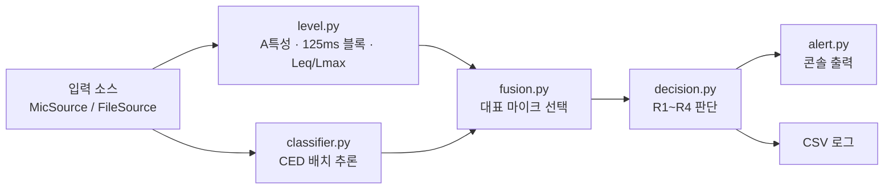

# noise_guard — 층간소음 경고 시스템 (Phase 1)

여러 개의 마이크로 집 안 소리를 실시간 수집하고, CED 오디오 분류 모델로 소리 종류를 판별해 한국 공동주택
층간소음 기준(2023 개정)을 넘는지 판단하고 경고하는 시스템입니다.

## 개요

- **Phase 1(현재)**: 노트북 한 대에서 수집, 레벨 계산, 분류, 판단, 알림까지 전체 파이프라인을 실행합니다.
  마이크 대신 wav 파일을 입력으로 쓸 수 있어, 장치 없이도 시나리오를 재현할 수 있습니다.
- **Phase 2(예정)**: 라즈베리파이 4가 수집, 레벨 계산, 판단, 알림(OLED/LED)을 맡고, 노트북은 CED 추론 서버가
  됩니다. 이를 위해 분류 진입점을 `CedClassifier.classify(batch)` 하나로 두었습니다.
- dB 값은 **소음계 보정 전 임시 오프셋**을 적용한 추정치입니다. 실제 음압 레벨이 아닙니다.



## 설치

전제 조건은 Windows 11, Python 3.11, CPU 추론입니다. GPU(CUDA/MPS)가 있으면 자동으로 사용합니다.

```powershell
py -3.11 -m venv .venv
.\.venv\Scripts\python.exe -m pip install -r requirements.txt
```

- `requirements.txt`는 동작을 확인한 버전으로 고정되어 있습니다.
    - torch와 torchaudio는 CPU 빌드(`2.11.0+cpu`)로, 짝이 맞는 버전입니다.
    - transformers는 `5.18.0`입니다.
- CED 모델(`mispeech/ced-base`)은 첫 실행 때 Hugging Face에서 내려받습니다.
    - `trust_remote_code` 모델이므로 원격 코드가 바뀌어도 동작이 같도록 `config.CED_MODEL_REVISION`으로 커밋을 고정했습니다.
    - CED 커스텀 feature extractor가 `torchaudio.transforms`를 쓰므로 torchaudio는 빠뜨리면 안 됩니다.

## 빠른 시작

장치 없이 파일 시나리오로 전체 파이프라인을 돌려 봅니다. ESC-50 클립이 `data/esc50/`에 있어야 합니다.
받는 방법은 [시나리오와 ESC-50 데이터](#시나리오와-esc-50-데이터)를 참고하세요.

```powershell
.\.venv\Scripts\python.exe -m tools.make_scenario
.\.venv\Scripts\python.exe main.py --source file `
    --files "거실=data/scenarios/S1_footsteps_x3_거실.wav" `
    --demo --fast --start-time "2026-10-02 14:00"
```

출력 예시입니다. 매 초 상태 한 줄이 나오고, 알림은 프레임 단위로 합쳐서 표시됩니다.

```text
14:00:23 | 거실   | Leq  68.6 Lmax  75.9 dB(A) | impact   | Walk, footsteps
!!!!!!!!!!!!!!!!!!!!!!!!!!!!!!!!!!!!!!!!!!!!!!!!!!!!!!!!!!!!!!!!!!!!!!!!
!! [경고] R1+R2+R3
   - [주의] 거실에서 충격소음(Walk, footsteps) 감지 — 최대 75.9 dB(A), 최근 1분 3회
   - [경고] 거실 충격소음 반복 — 최근 1분 3회 기준 초과 (거실 3회 / 주간 기준 57 dB(A))
   - [경고] 거실 충격소음 지속 — 최근 20초 Leq 61.8 dB(A) (주간 기준 39 dB(A))
!!!!!!!!!!!!!!!!!!!!!!!!!!!!!!!!!!!!!!!!!!!!!!!!!!!!!!!!!!!!!!!!!!!!!!!!
```

## 장치 매핑

마이크는 `config.MIC_DEVICES`에 `방 이름 → 장치 인덱스(또는 이름)`로 등록합니다.

1. 입력 장치 목록을 확인합니다.

    ```powershell
    .\.venv\Scripts\python.exe -m tools.list_devices
    ```

1. 같은 물리 장치가 호스트 API(MME, DirectSound, WASAPI, WDM-KS)마다 따로 나옵니다. 48kHz를 기본으로
   쓰는 **WASAPI** 항목의 인덱스를 고릅니다.
1. 같은 모델의 USB 마이크 여러 개는 이름이 같아서 이름으로 구분할 수 없습니다. 하나씩 꽂으면서
   `list_devices`를 다시 실행해, 새로 생긴 인덱스를 방에 대응시킵니다. 장치를 꽂고 빼면 인덱스가
   바뀔 수 있으므로 구성을 바꿀 때마다 다시 확인합니다.
1. `config.py`에 등록합니다.

    ```python
    MIC_DEVICES: dict[str, int | str] = {"거실": 18, "안방": 21}
    ```

1. 마이크 하나로 분류가 되는지 먼저 확인합니다.

    ```powershell
    .\.venv\Scripts\python.exe -m tools.classify_live --device 18
    ```

## 실행 방법

### main.py 옵션

| 옵션 | 설명 |
|---|---|
| `--source mic\|file` | 입력 소스. 기본값 `mic` |
| `--mics 거실,안방` | 마이크 모드에서 `MIC_DEVICES` 중 일부만 사용 |
| `--files 거실=a.wav,안방=b.wav` | 파일 모드 입력. 파일 하나를 마이크 하나로 간주하고 원래 샘플레이트를 유지 |
| `--demo` | 시연용 짧은 시간창 사용 |
| `--fast` | 파일 모드에서 기다리지 않고 가상 시계로 처리 |
| `--start-time "YYYY-MM-DD HH:MM"` | 파일 모드 가상 시계 시작 시각(Asia/Seoul). 야간 기준 테스트용 |
| `--file-end stop\|pad` | 파일이 끝나면 종료하거나 무음으로 계속 |
| `--duration 초` | 지정한 시간만큼 처리하고 종료 |
| `--log-file frames.csv` | 프레임별 결과 CSV. 원본 알림은 `frames_alerts.csv`에 함께 저장 |

Ctrl+C로 종료하면 스트림을 정리하고 요약을 출력합니다. 요약에는 총 프레임 수, 규칙별 알림 수,
overflow 횟수, 배치 추론 지연, 실시간 지연이 들어 있습니다.

### 실행 예시

```powershell
# 마이크, 데모 모드
.\.venv\Scripts\python.exe main.py --source mic --mics 거실 --demo

# 파일 두 개 동시, 야간, 로그 저장
.\.venv\Scripts\python.exe main.py --source file `
    --files "거실=data/scenarios/S5_two_rooms_거실.wav,안방=data/scenarios/S5_two_rooms_안방.wav" `
    --demo --fast --start-time "2026-10-02 23:00" --log-file data/runs/S5.csv
```

### 보조 도구

| 도구 | 용도 |
|---|---|
| `tools/list_devices.py` | 오디오 입력 장치 목록 |
| `tools/classify_live.py` | 단일 마이크 실시간 분류, top-5 라벨, 추론 지연, 참고용 dB |
| `tools/classify_file.py` | wav 파일·폴더 분류, ESC-50 클래스별 판정 분포 요약 |
| `tools/dump_labels.py` | CED `id2label` 전체를 `labels_dump.txt`로 저장 |
| `tools/make_scenario.py` | ESC-50 클립을 이어 붙여 시나리오 wav 생성 |
| `tools/calibrate.py` | 소음계 보정: 배경 소음, 볼륨별 오프셋, calibration.json 저장 ([소음계 보정](#소음계-보정) 참고) |

### 테스트

```powershell
.\.venv\Scripts\python.exe -m pytest           # 순수 로직 테스트 (장치·모델 불필요)
.\.venv\Scripts\python.exe -m pytest -m slow   # 시나리오 회귀 테스트 (CED + ESC-50 필요, 약 1분)
.\.venv\Scripts\python.exe -m black --check .
.\.venv\Scripts\python.exe -m ruff check .
```

### 시나리오와 ESC-50 데이터

시나리오는 [ESC-50][esc50]의 9개 클래스 클립 360개를 씁니다(약 150MB).

> **`data/` 폴더는 저장소에 포함되지 않습니다.** ESC-50 클립, 생성한 시나리오 wav, 실행 로그가 모두
> `data/` 아래에 있으며 아래 명령으로 다시 만들 수 있습니다.

ESC-50 저장소 전체(약 600MB)를 받는 대신, 메타데이터와 대상 9개 클래스의 wav만 받습니다.
프로젝트 루트의 Git Bash에서 실행합니다.

```bash
mkdir -p data/esc50/meta data/esc50/audio
base=https://raw.githubusercontent.com/karolpiczak/ESC-50/master
curl -sSfL -o data/esc50/meta/esc50.csv "$base/meta/esc50.csv"
classes='footsteps|door_wood_knock|door_wood_creaks|toilet_flush|pouring_water|water_drops|clapping|dog|crying_baby'
awk -F, -v pattern="^($classes)$" 'NR > 1 && $4 ~ pattern {print $1}' data/esc50/meta/esc50.csv \
    | xargs -P 8 -I{} curl -sSfL -o data/esc50/audio/{} "$base/audio/{}"
ls data/esc50/audio | wc -l   # 360이면 성공
```

받은 뒤 `.\.venv\Scripts\python.exe -m tools.make_scenario`로 `data/scenarios/`에 시나리오 wav를 만듭니다.

| 시나리오 | 내용 | 기대 알림 (데모, 주간) |
|---|---|---|
| S1 | 발소리 클립 3개, 5초 간격 | R1 ×3, R2 ×1, R3 ×3 |
| S2 | 물소리만 | 없음 |
| S3 | 물소리 + 발소리 (원래 진폭) | 없음 (알려진 한계: 마스킹) |
| S3b | 물소리 −20 dB + 발소리 | R1 ×1, R3 ×1 |
| S4 | 개 + 아기 울음 75초 | R4 ×7 |
| S5 | 거실 → 안방 발소리 (두 파일) | R1 ×2, R3 ×2, 위치 전환 |
| S6 | 방 5개 동시 (부하 확인용) | 회귀 대상 아님 |

## Phase 2 네트워크 실행 (작성 중)

> Phase 2 전체 설명(구조도, 통신 규격, 직결 랜 설정, Pi 실행)은 N8 단계에서 정리합니다.

### 마이크 이상 표시 확인 방법

`pi_client`의 파일 모드에 `--stall 방=시작초:길이초`를 주면, 그 구간 동안 해당 마이크만 전송을 멈춥니다.
청크는 버리고 seq는 계속 늘어나므로 실제 마이크가 멈춘 상황과 같습니다. 여러 개는 쉼표로 이어 씁니다.

```powershell
# 터미널 1: 서버
.\.venv\Scripts\python.exe main.py --source network --host 127.0.0.1 --demo

# 터미널 2: 안방 마이크만 10초 지점부터 8초 동안 멈춤
.\.venv\Scripts\python.exe -m pi_client.main --server 127.0.0.1 --source file `
    --files "거실=data/scenarios/S5_two_rooms_거실.wav,안방=data/scenarios/S5_two_rooms_안방.wav" `
    --stall 안방=10:8
```

- 서버 콘솔: `## [마이크 이상] 안방: 3초째 데이터 없음`이 뜨고, 상태 줄이 `마이크 1/2`로 바뀝니다.
  전송이 다시 시작되면 `## [마이크 복구]`가 뜹니다.
- 클라이언트 콘솔: STATUS를 받아 `[마이크 이상] 안방 (활성 1/2)`, 이어서 `[마이크 정상] 2/2`를 표시합니다.
- **멈춤은 5초 이상으로 주어야 합니다.**
    - 전송이 다시 시작되면 서버는 빠진 seq 구간을 무음으로 채웁니다.
    - 다른 마이크의 데이터가 도착한 뒤 `MIC_STALL_TIMEOUT_SEC`(2초) 안에 무음 채움이 도착한 tick은 빠짐이 아니라 무음으로 처리됩니다.
    - 그래서 L초 멈춤에서 빠짐으로 세는 tick은 약 L − 2개이고, 경고(`MIC_MISSING_WARN_TICKS` = 3)를 보려면 5초 이상이 필요합니다.

## 시연 전 체크리스트

시연 직전에 아래를 확인합니다.

1. **다른 프로그램을 종료합니다.** 브라우저, 메신저(Discord 등)가 CPU를 쓰면 추론이 순간적으로 느려져
   처리 지연이 1초를 넘을 수 있습니다(측정 중 실제로 1,463 ms까지 튄 적이 있음). 서버 로그에
   `[처리 지연] … ms > 1000 ms`가 보이면 이 상태입니다.
1. **노트북 전원을 연결하고 Windows 전원 모드를 "최고 성능"으로 둡니다.** 배터리 절약 모드에서는 CPU가 느려집니다.
1. **시연 중에는 서버를 재시작하지 않습니다.** 재시작하면 R1 카운트와 Leq 창이 초기화됩니다(Pi 재접속은 괜찮음).
1. **`calibration.json`이 있는지 확인합니다.** 서버 시작 로그에 `보정 적용: …`이 나와야 하고, `보정 안 됨`
   경고가 없어야 합니다.
1. **서버 상태 줄의 마이크 수가 모두 활성인지 확인합니다**(예: `마이크 5/5`, `4/5`가 아님).
   Pi 화면에 `[마이크 이상]`이나 `[서버 연결 끊김]`이 없어야 합니다.

## 설정값

주요 상수는 모두 `config.py`에 있습니다.

| 상수 | 값 | 설명 |
|---|---|---|
| `CAPTURE_SAMPLE_RATE` | 48000 | 마이크 수집 샘플레이트. dB 계산은 이 샘플레이트에서 함 |
| `CLASSIFY_WINDOW_SEC` / `CLASSIFY_HOP_SEC` | 2.0 / 1.0 | CED 분류 창과 간격. 16kHz로 리샘플해 입력 |
| `AIRBORNE_SCOPE` | `"extended"` | 공기전달소음 라벨 범위(`legal` / `extended`) |
| `CLASS_PROB_THRESHOLD` | IMPACT 0.2, AIRBORNE 0.3 | 카테고리 판정 임계값. **임시값** |
| `IMPACT_LMAX_LIMIT_*_DB` | 주 57 / 야 52 | 직접충격 Lmax 기준 |
| `IMPACT_LEQ_LIMIT_*_DB` | 주 39 / 야 34 | 직접충격 1분 Leq 기준 |
| `AIRBORNE_LEQ_LIMIT_*_DB` | 주 45 / 야 40 | 공기전달 5분 Leq 기준 |
| `LMAX_COUNT_TO_WARN` / `LMAX_WINDOW_SEC` | 3 / 3600 | R2: 1시간에 3회 |
| `IMPACT_LEQ_WINDOW_SEC` / `AIRBORNE_LEQ_WINDOW_SEC` | 60 / 300 | R3, R4 시간창 |
| `MERGE_GAP_SEC` | 2.0 | 같은 이벤트로 합치는 프레임 간격 |
| `EFFECTIVE_MERGE_GAP_SEC` | 3.0 | 실제 무음 기준 병합 간격(계산값, 문서용) |
| `COOLDOWN_SEC` | 30 | 같은 규칙 warning 재발령 금지 시간 |
| `DEMO_*` | Lmax 창 60, R3 창 20, R4 창 60, 쿨다운 10 | `--demo`에서 쓰는 시간창 |
| `LEQ_FLOOR_DB` | 0.0 | Leq 창에서 해당 카테고리가 아닌 구간을 채우는 바닥 레벨 |
| `DEFAULT_CALIBRATION_OFFSET_DB` | 100.0 | dBFS(A) → dB(A) 오프셋. **보정 전 임시값** |
| `MIC_DEVICES` | `{"거실": 18}` | 방 이름 → 장치 |

## 판단 규칙

주간(06–22시)과 야간(22–06시)은 프레임 시각의 로컬 시간(Asia/Seoul)으로 정합니다. 한국은 서머타임이
없으므로 고정 UTC+9를 씁니다. 판단 로직은 `frame.timestamp`만 시간으로 쓰고 내부에서 시계를 읽지 않습니다.

| 규칙 | 조건 | 결과 | 평가 시점 |
|---|---|---|---|
| R0 | 프레임 판정: IMPACT·AIRBORNE 중 임계값을 넘은 쪽 중 확률이 높은 쪽. 둘 다 미만이면 스킵 | 카테고리 | 매 프레임 |
| R1 | IMPACT 이벤트의 Lmax ≥ Lmax 기준 | caution, 카운트 +1 | 이벤트에서 처음 넘는 프레임에서 1회 |
| R2 | 시간창 안 R1 카운트 ≥ 3 | warning | R1 카운트가 늘 때 |
| R3 | IMPACT 프레임의 1분 Leq ≥ 기준 | warning | IMPACT 프레임이 들어올 때 |
| R4 | AIRBORNE 프레임의 5분 Leq ≥ 기준 | warning | AIRBORNE 프레임이 들어올 때 |

- R0은 사양 9.2의 프레임 판정을 이 문서에서 부르는 이름입니다. EXCLUDED(급배수)는 판정에 쓰지
  않습니다. 그래서 물소리 단독은 스킵되고, 물소리와 발소리가 겹쳐도 IMPACT가 임계값을 넘으면 IMPACT로
  처리합니다.
- warning은 같은 규칙에 대해 쿨다운 동안 다시 내지 않습니다.
- R2는 카운트가 늘 때만 평가합니다. 매 프레임 평가하면 카운트가 남아 있는 1시간 동안 같은 경고가 반복됩니다.
- R3/R4는 해당 카테고리 프레임이 들어올 때만 평가합니다. 소음이 멈춘 뒤 창에 남은 Leq로 경고가 반복되지 않게 하기 위해서입니다.
- R1/R2 카운트는 **집 전체 기준**입니다. 대신 R2 메시지에 방별 내역을 붙입니다(예: `거실 2회, 안방 1회`).
  같은 내역이 `Alert.room_counts`에도 들어 있습니다.

### 알림 합치기

`decision.py`는 규칙별로 Alert를 따로 반환합니다. `alert.py`는 같은 프레임에서 나온 알림을 **1건으로
합쳐** 표시합니다.

- 등급은 합친 알림 중 가장 높은 것을 씁니다(warning > caution).
- 규칙 목록은 발령 순서대로 `R1+R2+R3`처럼 붙입니다.
- CSV(`*_alerts.csv`)에는 합치기 전 원본 Alert를 모두 기록합니다.

## 설계 선택

### 카테고리별 Leq

R3/R4의 Leq는 **해당 카테고리로 판정된 프레임만** 에너지에 넣고, **창 전체 길이로 나눕니다**(사양 9.5의 (a)).
창 안에서 그 카테고리가 아닌 구간은 `LEQ_FLOOR_DB`(0 dB(A))로 채웁니다.

- 법정 측정은 카테고리를 구분하지 않고 잽니다. 이 시스템은 **분류된 소음의 기여분만 본다**는 설계를 택했습니다.
- 바닥 레벨 0 dB(A)는 기준값(34~57 dB(A))보다 충분히 낮습니다. 그래서 창 전체를 바닥 레벨로 채워도 결과에 영향이 없습니다.
- 시작 직후처럼 창이 다 차지 않았을 때도 창 전체 길이로 나눕니다. 시작 직후의 과대 경고를 막기 위해서입니다.
- 1초 프레임 하나만으로 기준을 넘는 레벨은 `기준 + 10·log10(창 길이 / 1초)`입니다.

| 규칙 | 창 | 주간 기준 | 1초 프레임 하나로 넘는 레벨 |
|---|---|---|---|
| R3 | 60초 | 39 | 56.8 dB(A) |
| R4 | 300초 | 45 | 69.8 dB(A) |
| R3 데모 | 20초 | 39 | 52.0 dB(A) |
| R4 데모 | 60초 | 45 | 62.8 dB(A) |

### 이벤트 병합과 R2/R3 역할 분담

같은 카테고리 프레임이 `MERGE_GAP_SEC`(2초) 이내로 이어지면 이벤트 하나로 봅니다. R1 카운트는 이벤트 단위입니다.

- 분류 창(2초)이 hop(1초)보다 깁니다. 그래서 소리가 끝난 뒤에도 약 1초 동안 IMPACT 판정이 이어집니다.
- 이 때문에 **실제 무음 기준 병합 간격은 약 3초**(`EFFECTIVE_MERGE_GAP_SEC`)입니다.
- 이 동작은 의도된 것이며, 두 규칙이 역할을 나눕니다.
    - **R2는 띄엄띄엄 반복되는 충격**을 잡습니다. 이벤트가 3초 넘게 떨어져 있어야 따로 셉니다.
    - **R3는 계속 이어지는 충격**을 잡습니다. 2초 간격으로 9번 걸은 발소리(S6 거실)는 이벤트 1개(R1 1회)로
      합쳐지지만, 걷는 동안 R3가 쿨다운마다 발령됐습니다(데모 모드에서 6회).

### 단발 충격에서 R1과 R3 동시 발령

R1은 `lmax_db`(125ms 블록 최댓값)를, R3는 `leq_db`(1초 에너지 평균)를 1분 창 전체로 나눠 씁니다.
그래서 둘이 함께 발령되는지는 충격음의 **Lmax − Leq 차이**와 **지속 시간**에 달려 있습니다.

- **단순 계산:** 1초 내내 57 dB(A)가 유지된다면 1분 Leq는 `57 − 10·log10(60) ≈ 39.2 dB(A)`입니다.
  이 경우 Lmax 기준(57)과 1분 Leq 기준(39)을 동시에 넘습니다.
- **실제 충격음:** 1초 안에서도 짧게 치솟고 금방 줄어들어서 프레임 Leq가 Lmax보다 낮습니다.
  ESC-50으로 잰 값은 아래와 같습니다(오프셋과 무관한 상대값).

| 소리 | Lmax − Leq | Lmax 57일 때 1분 Leq | R3 동시 발령 시작 Lmax |
|---|---|---|---|
| 단발 노크 5개 | 2.7~6.5 dB (중앙값 3.9) | 32.8~36.5 dB(A) | 59.5~63.2 dB(A) |
| 다발 노크 35개 | 중앙값 5.5 dB | — | 중앙값 60.4 dB(A) |
| 발소리 3개 (5초) | 7.5~7.8 dB | 32.7~38.3 dB(A) | 57.7~63.3 dB(A) |

- Lmax가 기준에 딱 걸치는 단발 충격은 R1만 발령됩니다.
- 기준보다 약 3~6 dB 큰 충격부터는 **단발이어도 R3가 함께 발령될 수 있습니다.**
- 주간과 야간 모두 두 기준의 차이가 18 dB(57/39, 52/34)라서 같은 관계가 성립합니다.
- 데모 모드는 R3 창이 20초라서 Lmax 57에서도 20초 Leq가 37.5~43.1 dB(A)입니다. 그래서 대부분 함께 발령됩니다.

### 대표 마이크 선택

같은 시점에 여러 마이크가 같은 소리를 잡으므로, 1초 Leq가 가장 큰 마이크를 대표로 삼습니다.
위치, 레벨, 카테고리 확률 모두 그 마이크 값을 씁니다(`fusion.py`).

### AIRBORNE 범위: legal과 extended

카테고리 `AIRBORNE`은 하나이고, `AIRBORNE_SCOPE`에 따라 매핑되는 AudioSet 라벨 집합만 바뀝니다.

- **`legal`**: Television, Radio, AudioSet Music 하위 전체(악기·장르)입니다. 법적 공기전달소음은
  **텔레비전·음향기기 등의 사용으로 발생하는 소음**이 대상이므로, 이 범위가 법 기준에 해당합니다.
- **`extended`(기본값)**: legal에 말소리·목소리, 군중, 휘파람, 개·고양이, 청소기, 블렌더를 더합니다.
  법 기준 밖이지만 이웃이 실제로 불편을 느끼는 생활 소음까지 알려주는 **배려 확장 모드**입니다.
  이 모드의 경고는 법적 기준 초과를 뜻하지 않습니다.
- 박수(`Clapping`)와 군중 박수(`Applause`)는 두 범위 모두에서 OTHER입니다.
- 라벨 문자열은 `tools/dump_labels.py`로 덤프한 CED `id2label` 값을 그대로 씁니다. 테스트가 오타를 검사합니다.

### 조용할 때 분류 건너뛰기 (게이트)

마이크의 **분류 창(2초) Leq**가 `SKIP_CLASSIFY_BELOW_DB`(24 dB(A), 보정 전 임시)보다 낮으면 그 마이크는 CED에
넣지 않고 확률 0, 라벨 `(skipped: quiet)`으로 채웁니다. 모든 마이크가 조용하면 CED를 호출하지 않습니다.
`--no-skip`으로 끌 수 있습니다.

- **1초가 아니라 2초 분류 창으로 판정하는 이유:** CED는 2초 창을 보고 분류합니다. 큰 소리가 막 끝난
  프레임은 1초 Leq로는 조용하지만 창 안에는 그 소리가 있어서 CED가 IMPACT로 볼 수 있습니다. 1초 기준으로 이런
  프레임을 건너뛰면 이벤트 병합이 달라져 알림이 `--no-skip`과 달라졌습니다(마이크 1개 S6에서 R1 1회 추가).
  판정 구간을 분류 창과 맞추면 알림이 같아집니다(시나리오 S1~S6 모두 일치 확인).
- 게이트는 `최저 판단 기준(34) − SKIP_MARGIN_DB(10)` 이하여야 하며, 시작할 때 검사합니다. 기준 근처 소리를
  건너뛰면 R3/R4 Leq가 과소평가되기 때문입니다.
- "크면 분류 없이 통과"는 넣지 않았습니다. 물소리를 거르지 못하기 때문입니다.
- 지금 값은 보정 전 임시 오프셋 기준이라 의미가 없습니다. 보정 후 `tools/calibrate.py`가 출력하는
  권장 게이트를 참고해 정합니다.

### 카테고리별 판정 임계값

`CLASS_PROB_THRESHOLD = {IMPACT: 0.2, AIRBORNE: 0.3}`이며, ESC-50 근거리 녹음으로 정한 임시값입니다.

- **AIRBORNE 0.3:** 디지털 무음과 조용한 방에서도 CED가 `Music`을 0.11~0.13으로 냅니다. 그보다 충분히 높게 잡았습니다.
- **IMPACT 0.2:** 무음 바닥값이 0.002 수준이라 충분히 떨어져 있습니다. 0.3보다 발소리 검출률이 높습니다(클립 82% vs 72%).

### 보정 전 임시 오프셋

`DEFAULT_CALIBRATION_OFFSET_DB = 100`은 가까이서 말할 때 약 −40 dBFS가 나온 것을 일반 대화 약 60 dB(A)로
보이게 맞춘 값입니다. **실제 음압 레벨이 아닙니다.** 소음계 보정 뒤 마이크별 값으로 바꿉니다.

### 소음계 보정

`tools/calibrate.py`로 마이크별 오프셋(dBFS(A) → dB(A))을 잽니다. 레벨 계산은 서버와 같은 `LevelMeter`
(마이크 원래 샘플레이트에서 A특성, 125ms 블록, 블록 사이 필터 상태 유지)를 씁니다.

1. 방을 조용하게 두고 배경 소음을 `CALIBRATION_MEASURE_SEC`(10초) 동안 잽니다.
1. 스피커로 핑크노이즈를 일정하게 재생합니다.
1. 소음계를 마이크 바로 옆에 두고 **A특성, Leq 모드**로 맞춥니다. Leq 모드가 없으면 Fast로 여러 번 읽어 평균합니다.
1. 프로그램이 10초 동안 Leq를 재는 동안 소음계도 같은 시간 동안 잽니다.
1. 소음계 값을 입력하면 `offset = 소음계 Leq − 프로그램 Leq`를 계산합니다.
1. `--levels 3`이면 볼륨을 바꿔 4~5를 세 번 하고, 오프셋 차이가 `CALIBRATION_MAX_SPREAD_DB`(2 dB)를 넘으면
   경고합니다. 마이크 AGC(자동 이득)가 켜져 있으면 이 차이가 커집니다.
1. 단계마다 핑크노이즈 Leq가 배경 Leq보다 `CALIBRATION_MIN_SNR_DB`(10 dB) 이상 크지 않으면
   "보정 신호가 배경 소음에 비해 작음, 볼륨을 올리세요"라고 경고하고, 그 단계를 다시 잴지 묻습니다.
   신호가 작으면 배경 소음이 섞여 오프셋이 틀어지기 때문입니다.

```powershell
# 노트북에 꽂은 마이크 (장치 번호는 tools.list_devices로 확인)
.\.venv\Scripts\python.exe -m tools.calibrate --mic 거실 --source mic --device 18 --levels 3

# Pi 마이크: 이 도구가 서버가 되고, Pi에서는 평소처럼 pi_client를 실행한다
.\.venv\Scripts\python.exe -m tools.calibrate --mic 거실 --source network --port 5000 --levels 3
```

결과는 `calibration.json`에 방 이름별로 저장됩니다(`offset_db`, `meter_leq`, `program_leq`, `levels`,
`background_leq_db`, `sample_rate`, `device`, `measured_at`). 다른 방의 결과는 그대로 둡니다.
형식은 [calibration.example.json](calibration.example.json)에 있습니다(숫자는 모두 예시값).

- **보정값은 마이크 장비와 설치 위치마다 다른 값이라 git에 넣지 않습니다**(`.gitignore`에 등록).
  팀원과 공유하려면 `calibration.json` 파일을 직접 전달하세요. 마이크나 위치를 바꾸면 다시 잽니다.
- 테스트와 예시 생성은 프로젝트 루트에 `calibration.json`을 만들지 않습니다(테스트는 임시 폴더,
  예시는 `data/` 아래). 테스트가 루트에 만들면 실패하도록 `tests/conftest.py`가 검사합니다.

- 서버는 시작할 때 `calibration.json`(또는 `--calibration-file`)이 있으면 방별 오프셋을 씁니다.
- 파일에 없는 방은 임시 오프셋 +100 dB를 쓰고, **시작 로그와 그 방의 모든 알림에 "보정 안 됨"을 표시**합니다
  (콘솔, Pi 디스플레이).
- 파일이 깨져 있으면 몇 번째 줄이 틀렸는지 알려주고 시작하지 않습니다.

보정이 끝나면 배경 소음(보정 후 dB(A))으로 두 가지를 점검해 경고합니다. **게이트 값은 자동으로 바꾸지
않고 권장값만 출력**합니다.

- 배경 Leq ≥ `SKIP_CLASSIFY_BELOW_DB`: 게이트가 배경 소음보다 낮아 건너뛰기가 일어나지 않습니다.
- 배경 Leq ≥ 최저 판단 기준(야간 34) − 5: 배경 소음이 기준에 가까워 오탐 위험이 있습니다.
- 권장 게이트 = min(배경 Leq + 3 dB, 최저 기준 − 마진 10 dB).

## 성능

측정 환경은 Intel i7-1360P, CPU 추론입니다. 측정에는 S6 시나리오를 썼습니다.

| 모드 | 마이크 수 | 배치 추론 평균 / 최대 | 예정 시각 대비 지연 평균 / 최대 |
|---|---|---|---|
| `--fast` | 1 | 178 / 288 ms | — |
| `--fast` | 3 | 396 / 639 ms | — |
| `--fast` | 5 | 644 / 824 ms | — |
| 실시간 | 3 | 269 / 339 ms | 307 / 406 ms |
| 실시간 | 5 | 398 / 507 ms | 455 / 594 ms |

- 실시간 5개 기준으로 hop(1초) 대비 **약 400 ms의 여유**가 있습니다.
- 지연은 누적되지 않았습니다. 68초 파일을 68.3초에 처리했고, 1초를 넘긴 프레임은 0개였습니다.
- `--fast`는 쉬지 않고 연속으로 추론하므로 실시간보다 지연이 큽니다.

## 알려진 한계

### 마스킹

물소리가 발소리보다 훨씬 크면 CED가 발소리를 듣지 못해, IMPACT 확률 자체가 임계값에 못 미칩니다.

- S3에서는 물소리와 발소리의 RMS 차이가 약 21 dB였고, IMPACT 확률은 최대 0.05였습니다. 그래서 기대 결과를 "알림 0"으로 둡니다.
- 물소리를 20 dB 낮춘 S3b에서는 두 쌍 중 한 쌍만 IMPACT로 잡혔습니다.
- 판정 규칙("EXCLUDED가 높아도 IMPACT가 임계값을 넘으면 IMPACT")은 분류기가 발소리를 들었을 때만 의미가 있습니다.

### 음조 있는 소리의 음악 오분류

ESC-50 결과(IMPACT 0.2 / AIRBORNE 0.3, extended, 클립 단위)입니다.

| 소리 | 오분류 | 비율 | 원인 라벨 |
|---|---|---|---|
| 문 삐걱 | AIRBORNE | 45% | `Music`, `Theremin`, `Synthesizer` |
| 물방울 | AIRBORNE | 18% | `Wood block` |

- 원인 라벨이 법적 공기전달소음(음악·악기) 집합에 속해서, 범위를 바꿔도 피할 수 없습니다.
- R4가 5분 Leq이고 창 전체 길이로 나누므로, 몇 초짜리 오분류는 경고까지 가기 어렵습니다.
- **단, 1초 프레임 하나가 69.8 dB(A)(데모 모드는 62.8) 이상이면 그것만으로 R4 기준을 넘습니다.**
- 보정 전 임시 오프셋에서는 ESC-50 클립이 80~90 dB(A)로 나옵니다. 그래서 시나리오 테스트에서는 R4가 첫 프레임에서 바로 발령됩니다.

### 노트북 내장 마이크 DSP

인텔 SST 마이크 배열은 드라이버 DSP가 말소리가 아닌 소리(박수, 두드림)를 거의 지우고, 조용하면 신호를
디지털 무음 근처까지 내립니다.

- 그래서 내장 마이크로는 말소리만 실시간 검증했습니다.
- 충격음과 물소리는 ESC-50 파일로 검증했습니다.
- 이 마이크로 잰 dB 값은 의미가 없습니다.

### ESC-50 근거리 녹음 기준 임계값

임계값, 무음 바닥값, 오분류율은 모두 근거리에서 녹음한 ESC-50 클립으로 정했습니다. 바닥과 벽을 통과한
소리는 고역이 깎이므로 확률이 더 낮게 나올 수 있습니다.

### 서버 재시작 시 판단 상태 초기화

판단 상태(R1 카운트, R3/R4의 Leq 창, 쿨다운)는 노트북 서버 프로세스의 메모리에만 있습니다.

- Pi가 끊겼다가 다시 연결되는 경우에는 서버가 같은 판단 엔진을 쓰므로 상태가 이어집니다.
- **서버 프로세스를 재시작하면 상태가 모두 초기화됩니다.** 예를 들어 R1 2회가 쌓인 상태에서 재시작하면
  다음 충격은 1회부터 다시 셉니다.
- **시연 중에는 서버를 재시작하지 마세요.**

### `--stall`로 멈춘 시간과 빠짐 집계의 차이

`--stall`로 L초 멈추면 **약 L − 2개 tick만 빠짐으로 셉니다.**

- 전송이 다시 시작되면 서버는 빠진 seq 구간을 무음으로 채웁니다.
- 다른 마이크의 데이터가 도착한 뒤 `MIC_STALL_TIMEOUT_SEC`(2초) 안에 이 무음 채움이 도착한 tick은
  빠짐이 아니라 무음으로 처리됩니다.
- 그래서 마이크 이상 경고(3 tick 연속)를 보려면 5초 이상 멈춰야 합니다.

## 남은 작업

1. **USB 마이크 실측:** IMPACT 실시간 검증, 실제 방 소음에서의 무음 바닥값, overflow 확인
1. **소음계 보정:** `tools/calibrate.py` 구현, `calibration.json` 로딩, 마이크별 오프셋 확정
1. **미니어처 스케일링:** 우드락 미니어처에 맞게 기준값과 시간창을 config 값으로 조정
1. **임계값 재조정:** USB 마이크와 미니어처 환경에서 IMPACT/AIRBORNE 임계값 다시 결정
1. **Scrape/Squeak 매핑 검토:** 의자 끄는 소리 후보(`Scrape`, `Squeak`, `Rub`, `Scratch`, `Creak` 등)를 IMPACT에 넣을지 결정
1. **Phase 2 Pi 분리:** `CedClassifier.classify`를 TCP 클라이언트로 교체, `alert.py`에 OLED/LED 출력 추가

## 참고

- [ESC-50 데이터셋][esc50]
- [CED 모델 카드(mispeech/ced-base)][ced]

[esc50]: https://github.com/karolpiczak/ESC-50
[ced]: https://huggingface.co/mispeech/ced-base
